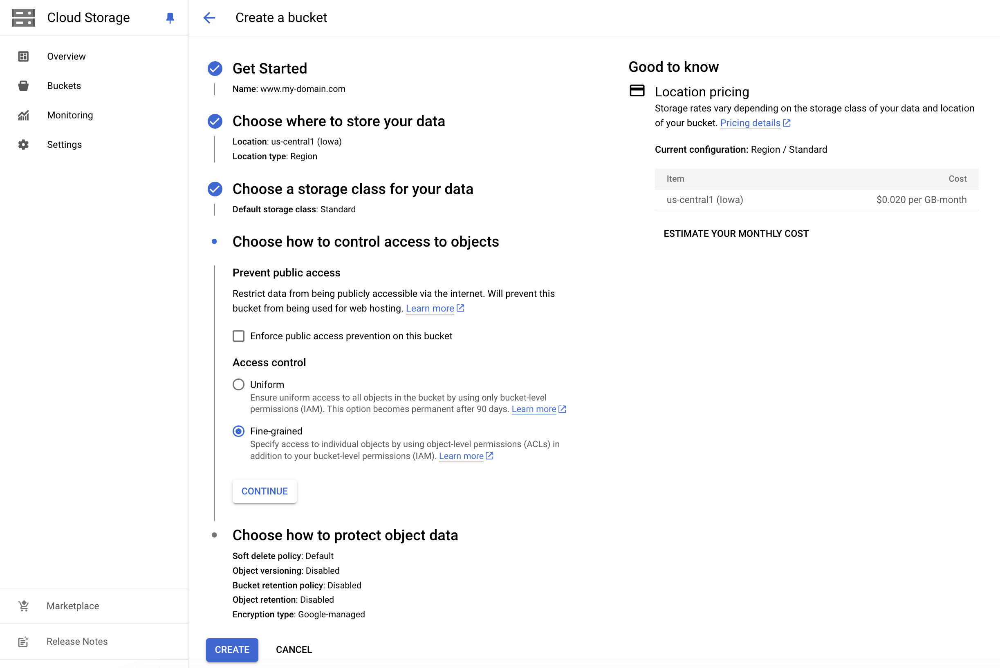
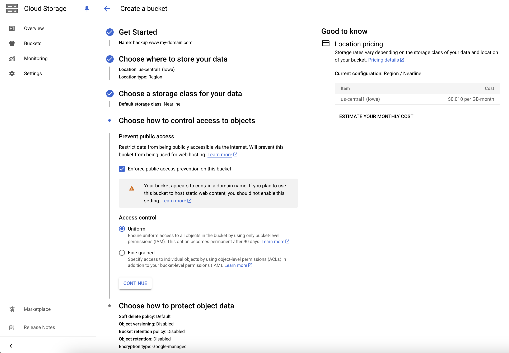

# Custom Domain configuration and securing + Wix premium features bypass

         

---

## Table of Contents

1. [Disclaimer](#disclaimer)  
2. [Overview](#overview)  
3. [Features](#features)  
4. [Prerequisites](#prerequisites)  
5. [Google Cloud Platform (GCP) Setup](#google-cloud-platform-gcp-setup)  
6. [Cloudflare Setup](#cloudflare-setup)   
7. [HTML Files for Wix Banner Removal](#html-files-for-wix-banner-removal)  
8. [Acknowledgments](#acknowledgments)  
9. [License](#license)  

---

## Disclaimer

**This is a research project** designed to showcase how iframe manipulation and DNS configuration can be leveraged to bypass basic free-tier restrictions. The guide is not intended to encourage users to avoid paying for Wix's premium services.
\
\
The author assumes **no responsibility** for any misuse of the information provided, including any breach of Wix's terms of service.
\
\
While the primary focus is on bypassing certain free-tier restrictions on Wix, the methods presented here for domain configuration, static site hosting, and security via Cloudflare can be repurposed for many other use cases.

---

## Overview

This guide demonstrates how to:  
1. Set up a custom domain and configure DNS.
2. Set up a static website with Google Cloud Storage that will be reached via a custom domain.
3. Host your site using Google Cloud Storage.
4. Configure SSL, Namespace and Firewall through Cloudflare.
5. Iframe manipulation for removing Wix banner on desktop and mobile.
\
The guide is intended for techincal and non-technical audience. Steps requiring more in-depth knoledge are marked with a ✬ symbol.

---

## Features

- **Custom Domain Integration**  
  Connect your domain to your Wix site by hosting a static website on Google Cloud Storage Bucket.

- **Free-tier Banner Removing**  
  Remove the Wix banner for cleaner desktop and mobile presentations.

- **Static Hosting**  
  Use Google Cloud Storage as a static website host.  

- **Secure Website**  
  Implement HTTPS and WAF with Cloudflare.

---

## Prerequisites

To use this guide, you'll need:  
- A registered domain name.  
- Access to Google Cloud Platform (GCP).  
- A Cloudflare account.  
- Basic understanding of DNS and hosting.  

---

## Step-by-Step Guide


### Domain Registration  
   - Purchase and register a domain. Namecheap or GoDaddy are usually suggested.

### GCP Static Website Setup


#### GCP Configuration 

1. **Set up a GCP project**  
   - [GCP Free trial credit](https://cloud.google.com/free/docs/free-cloud-features) can be used for our purposes.

2. **Set up a GCP bucket for hosting**  
   - Use the same name as the registered domain with the format `www.my-domain.com`.
   - For our private-use, research-purpose project, we select a single region, like `us-central1`.
   - Deselect *Enforce public access prevention on this bucket* as we will be granting our file public access.  

     

      - ✬ Equivalent gcloud commands:
     
     
        ```bash
        gcloud config set project <YOUR_PROJECT_ID>  # Replace with your actual project ID
        # Set the region to us-central1
        gcloud config set compute/region us-central1  
   
        # Create the bucket
        gcloud storage buckets create gs://www.my-domain.com \
          --location=us-central1 \
          --storage-class=STANDARD \
          --no-uniform-bucket-level-access \
          --public-access-prevention=disabled \
          --website-main-page-suffix=index.html \  # Enable static website hosting.
          --website-not-found-page=404.html
        ```

   - *Additional but not required:* Create a storage acting as a backup with the `NEARLINE` storage class for reducing costs and set up a replication policy.
     
     
     
     
     
     - ✬ gcloud commands:  

     
       ```bash
       # Create the second bucket:
       gcloud storage buckets create gs://www-my-domain-backup \
         --location=us-central1 \
         --storage-class=NEARLINE \
         --uniform-bucket-level-access \
         --public-access-prevention

       # Enable the Storage Transfer Service API:
       gcloud services enable storagetransfer.googleapis.com

       # Set up the IAM roles for the first bucket to allow replication:
       gcloud storage buckets add-iam-policy-binding gs://www.my-domain.com \
         --member=serviceAccount:storage-transfer-service-<YOUR_PROJECT_NUMBER>@gcp-sa-storagetransfer.iam.gserviceaccount.com \
         --role=roles/storage.objectAdmin

       # Create the replication policy:
       gcloud storage buckets update gs://www.my-domain.com \
         --add-replication=destination=gs://www-my-domain-backup
       ```
   
   - ✬ A Terraform equivalent, including the `index.html` and `mobile.html` creation, can be found at [main.tf](terraform/main.tf).


---

### Cloudflare Setup

#### Overview  
This section covers the configuration of HTTPS, DNS, nameservers, and Web Application Firewall (WAF) rules using Cloudflare. The goal is to secure your static website hosted on Google Cloud Platform (GCP) and ensure proper traffic handling.  


#### Prerequisites  
   - A Cloudflare account.  
   - The domain name registered and added to your Cloudflare account.  
   - Access to the DNS management settings in your registrar's dashboard.  

1. **Add Your Domain to Cloudflare**  
   - Log in to your Cloudflare account.  
   - Click on **Add a Site** and enter your domain name (e.g., `my-domain.com`).  
   - Cloudflare will scan your existing DNS records. Verify them and make necessary adjustments.  

2. **Set Up DNS Records**  
   - Add a **CNAME** record pointing from `www.my-domain.com` to the GCP bucket hosting your static website:  
     | Name  | Type  | Content                   | TTL      |
     |-------|-------|---------------------------|----------|
     | www   | CNAME | c.storage.googleapis.com | Auto     |
     
     - Import file alternative (change content with your domain name)
       - [my-domain.txt](cloudflare/dns/my-domain.txt)
     - ✬ CLI alternative (using Cloudflare API):
       ```bash
       curl -X POST "https://api.cloudflare.com/client/v4/zones/<ZONE_ID>/dns_records" \
       -H "Authorization: Bearer <API_TOKEN>" \
       -H "Content-Type: application/json" \
       --data '{
         "type":"CNAME",
         "name":"www.my-domain.com",
         "content":"c.storage.googleapis.com",
         "ttl":1,
         "proxied":true
       }'
       ```

3. **Change Nameservers**  
   - Cloudflare will provide two nameservers (e.g., `ns1.cloudflare.com` and `ns2.cloudflare.com`) under the page DNS/Records.  
   - Update your registrar's DNS settings to point to these nameservers. This change may take up to 48 hours to propagate.  

4. **Enable HTTPS**  
   - In Cloudflare's **SSL/TLS** section, set the mode to **Full** or **Full (strict)** for secure communication.  
   - Toggle **Always Use HTTPS** to automatically redirect HTTP traffic to HTTPS.  

5. **Add Redirect Rules**  
   - Go to the **Rules** section and create the following redirects:
     - **Redirect HTTP to HTTPS**  
       Match: `http://*/*`  
       Redirect to: `https://$1/$2`  
       (Enable "Forwarding URL")  

     - **Redirect Root HTTPS to WWW**  
       Match: `https://my-domain.com/*`  
       Redirect to: `https://www.my-domain.com/$1`  
       (Enable "Forwarding URL")  


#### Configure Cloudflare WAF Rules  

1. **Restrict Traffic to Specific Countries**  
   - Rule: Allow traffic only from specified country.  
   - Expression example:  
     ```plaintext
     not ip.geoip.country in {"GB" "US" "DE"}
     ```

2. **Block Access to Unwanted Pages**  
   - Rule: Block all pages except the allowed ones.  
   - Expression:  
     ```plaintext
     not ends_with(http.request.full_uri, "/") and
     not ends_with(http.request.full_uri, "/favicon.ico") and
     not ends_with(http.request.full_uri, "/mobile.html")
     ```

3. **Block Suspicious User Agents**  
   - Rule: Block bots, crawlers, and headless browsers.  
   - Expression:  
     ```plaintext
     (http.user_agent contains "bot") or 
     (http.user_agent contains "crawl") or 
     (http.user_agent contains "spider") or 
     (http.user_agent contains "Headless") or 
     (not ssl)
     ```

4. **Block Based on Threat Score**  
   - Rule: Block if threat_score >= 1
   - Expression:  
     ```plaintext
     cf.threat_score ge 1
     ```

5. **Block Known Bots**  
   - Rule: Block all known bots.  
   - Enable the "Known Bots" option in Cloudflare WAF.


#### Test the Configuration  
- Verify that `www.my-domain.com` resolves correctly and loads your static website.  
- Ensure HTTPS is enforced and all redirects work as expected.  
- Test the WAF rules using different countries, user agents, and URLs.


This setup ensures secure and optimized traffic handling for your custom domain, leveraging Cloudflare's powerful tools to enhance the functionality and security of your site.

---

### HTML Files for Wix Banner removal

#### Overview  
This section presents the two `index.html` and `mobile.html` files. The `index.html` is pretty straightforward, it contains a shifted iframe pointing at the wix webiste and a redirect to mobile.html when the screen with is less then 900px.
\
\
The `mobile.html` is a bit more complex as Wix forces a 320px width that results in a non-responsive resizing. This is addressed through zooming in/out the iframe as screen sizes changes.
*Note: I implemented the zooming feature using some help from ChatGpt, it may be enhanced more*

#### The files

1. **index.html**
   - switch Wix url with your actual Wix website url
   - select a custom title  
   
   <br>
   
   ```html
      </head>
        <title>My Custom Title</title>
        <link rel="icon" href="https://storage.googleapis.com/www.my-domain.com/favicon.ico" type="image/x-icon">
        <body>
          <iframe src="https://username.wixsite.com/name" style="position:fixed; top:-50px; left:0px; bottom:0px; right:0px; width:100%; height:105%; border:none; margin:0; padding:0; overflow:hidden; z-index:999999;">
          </iframe>
          
          <script type="text/javascript">
          if (screen.width <= 900) {
            document.location = "/mobile.html";
          }
          </script>
        
        </body>
      </html>
   ```
   
3. **mobile.html**
   - switch Wix url with your actual Wix website url
   - select a custom title
     
   <br>
   
   ```html
      <html>
        <title>My Custom Title</title>
          <link rel="icon" href="https://storage.googleapis.com/www.my-domain.com/favicon.ico" type="image/x-icon">
          <meta name="viewport" content="width=device-width, initial-scale=1.0">
        <style>
          /* Hide only the Wix ad banner */
          iframe {
            position: fixed;
            left: 0;
            top: -39px; /* Adjust as needed to hide the banner */
            width: 100%;
            height: calc(100% + 39px); /* Adjusted to cover the area hidden by the banner */
            border: none;
          }
          /* Remove any padding and margin */
          body {
            margin: 0;
            padding: 0;
            background-color:#E9CAB1;
          }
        </style>
      
        <body>
        
          <iframe src="https://username.wixsite.com/name" style="    position: fixed;    left: 0px;    top: -39px;    width: 100%;    height: 108%;}">
          </iframe>  
          <script>
            function resizeIframe() {
              const iframe = document.querySelector('iframe');
              const screenWidth = window.innerWidth;
              const screenHeight = window.innerHeight;
      
              // Define the base width and top offset of the Wix content
              const baseWidth = 320; // Original width of the Wix content
              const baseTop = -39;   // Original `top` offset
              const scaleFactor = screenWidth / baseWidth;
      
              // Apply scaling to the iframe
              iframe.style.transform = `scale(${scaleFactor})`;
              iframe.style.transformOrigin = "top left";
      
              // Adjust iframe's dimensions and position
              iframe.style.width = `${baseWidth}px`; // Original content width
              const newHeight = (screenHeight / scaleFactor) - (baseTop * scaleFactor); // Compensate for banner removal
              iframe.style.height = `${newHeight}px`; // Scaled height to fit the viewport
              iframe.style.left = `calc((100vw - ${baseWidth}px * ${scaleFactor}) / 2)`; // Center horizontally
              iframe.style.top = `${baseTop * scaleFactor}px`; // Scale the top offset
            }
      
            // Run resize function immediately after DOM is loaded
            document.addEventListener('DOMContentLoaded', resizeIframe);
      
            // Resize on window resize events (debounced for better performance)
            let resizeTimeout;
            window.addEventListener('resize', () => {
              clearTimeout(resizeTimeout);
              resizeTimeout = setTimeout(resizeIframe, 100);
            });
          </script>
        </body>
      </html>
   ```
5. **favicon.ico**
   - you can upload a custom favicon.ico to the bucket and reference it into index.html and mobile.html

---

## Acknowledgments

Special thanks to [bobojean](https://github.com/bobojean) and their repository [Hiding-Wix-Ad-for-Free](https://github.com/bobojean/Hiding-Wix-Ad-for-Free) for their initial work on this topic. This guide builds upon and completes their effort.

---

## License

This project is licensed under the MIT License. See [LICENSE](LICENSE) for details.  

---

